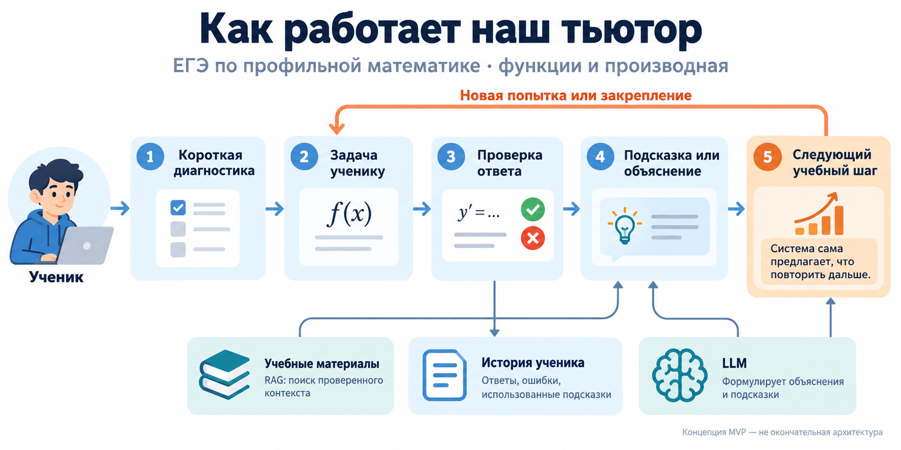

# Проактивная тьюторская система с использованием LLM и RAG

Годовой проект №65, 2026/27 учебный год.

Разрабатываем прототип тьюторской системы для самостоятельной подготовки к отдельным темам ЕГЭ по профильной математике. Система будет объяснять материал с опорой на учебные источники, проверять ответы, учитывать историю затруднений и предлагать следующий учебный шаг.

Предварительная предметная область — функции, производная и исследование функций. Объём MVP и план ниже являются черновиком для обсуждения с командой и куратором; архитектура пока не зафиксирована.

## Видение проекта

Идея — инструмент между самостоятельным решением задач и занятиями с репетитором: ученик получает не только проверку ответа, но и последовательные подсказки, объяснение ошибок и предложение следующего задания.

ЕГЭ выбран как понятная, структурированная задача с доступными официальными материалами и критериями проверки. Для RAG подготовим отдельный корпус учебных объяснений с учётом условий использования источников. Функции и производная — связанный блок с конкретными навыками и задачами, для которых можно подготовить эталоны и измерять качество работы системы.

Основной фокус — инженерный: собрать работающий MVP и проверить качество его компонентов и учебных сценариев. Если появится возможность, постараемся провести добровольный пилот со школьниками и получить обратную связь.

## Команда

- [Vladislav Chumachenko](https://github.com/ThreeHundredsperSecond)
- [Bogdan Luckyanchuk](https://github.com/Bogdan108)
- [Salman Chakaev](https://github.com/srchakaev)
- [Alexander](https://github.com/ex-alander)

## Куратор

- [Фарид Мустафин](https://github.com/lanarich)

## План работы

| Этап | Срок | Планируемый результат |
|---|---|---|
| Старт и планирование | До 6 октября 2026 | Согласовать тему, цель, границы MVP и годовой план |
| Анализ данных и материалов | До 27 октября 2026* | Подготовить корпус, карту навыков и набор задач с эталонами |
| Базовое решение | До 27 ноября 2026* | Реализовать базовый RAG-тьютор и первые проверки качества |
| Сервис | До 15 декабря 2026* | Реализовать FastAPI-сервис со сквозной учебной сессией и сохранением истории |
| Промежуточная защита | 10–15 января 2027* | Показать прототип, результаты проверок и план второго семестра |
| Персонализация | До 15 марта 2027* | Добавить профиль ученика и адаптивный выбор помощи и заданий |
| Улучшение и сравнение | До 5 мая 2027* | Проверить варианты компонентов, реализовать проактивные предложения и сравнить с базовым решением |
| Финальные доработки | Май — начало июня 2027 | Обеспечить воспроизводимость, логирование, анализ ошибок и подготовить демонстрацию |
| Итоговая защита | 13–20 июня 2027* | Представить работающий MVP, результаты и ограничения |

\* Ориентировочные сроки из календаря программы. Содержание этапов адаптировано под тьюторскую систему и требует согласования с куратором.

На этапе EDA изучим покрытие навыков, типы задач и ответов, пробелы и дубли в корпусе, а также возможности автоматической проверки. Дальнейшие этапы и технические решения могут уточняться по результатам этой работы.

[Подробный план проекта](docs/project-plan.md): обоснование, задачи, сценарий MVP, проверка качества и открытые вопросы.

## Исследовательские материалы

Уже собраны [предварительный обзор и подборка статей о LLM-тьюторах](research/deep-research-llm-based-its.md). На следующем этапе используем их для анализа данных и материалов (EDA) и уточнения вариантов архитектуры. Текущий план — отправная точка для обсуждения, а не окончательная спецификация.
