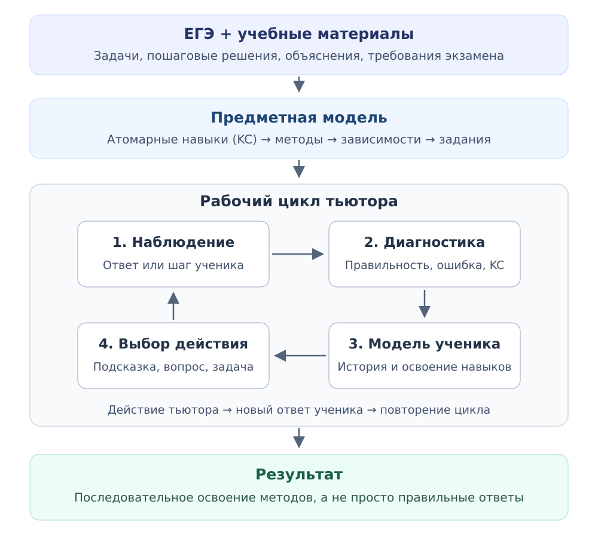

# Рабочее видение проекта

Статус: рабочая версия для обсуждения с командой и куратором, не утверждённая архитектура. Обновлено: 10 октября 2026 года.

Этот документ — точка входа в концепцию системы: что хотим построить, как связаны её части и какие решения ещё предстоит принять. Сроки и этапы находятся в [плане проекта](project-plan.md), обзор подходов — в [исследовательских материалах](../research/deep-research-llm-based-its.md).

## Проект на одной схеме

### Четыре вопроса концептуальной модели

1. Что система знает о математике?
2. Что система знает об ученике?
3. Какие действия система может выполнять?
4. На основании чего выбирается следующее действие?

Предметная модель даёт основу для первого вопроса. Правила диагностики, обновления профиля и выбора педагогического действия ещё предстоит определить.

## 1. Идея и границы

Разрабатываем адаптивную тьюторскую систему для подготовки к профильному ЕГЭ по математике. Система должна понимать, какой метод ученик пытается применить, на каком шаге испытывает затруднение и какое педагогическое действие сейчас уместно.

Цель учебной сессии — помочь ученику самостоятельно освоить метод и перенести его на другую задачу. Правильный ответ после показа решения сам по себе не подтверждает освоение.

В качестве начального блока рассматриваем функции, производную и исследование функций. Точный набор навыков, задач и глубина проверки пока открыты. Текущий этап подготовки данных должен прояснить эти границы.

**Зафиксированная отправная точка:** прототип тьютора по ограниченному блоку профильной математики ЕГЭ; учебные материалы, задачи с эталонами и учёт затруднений ученика.

**Рабочие гипотезы:** три модели ниже, построение навыков из решений задач и явный выбор педагогического действия. Конкретные алгоритмы, технологии и формат интерфейса ещё не выбраны.

### Основной сценарий: тренировка навыков через явные шаги

**Рабочая гипотеза:** ядро системы — тренировка методов решения через наблюдаемые действия ученика. Для семейства задач заранее описываем содержательные шаги и связанные с ними KC; взаимодействие организуем так, чтобы ученик мог явно выполнять эти действия.

Формализуем обе стороны: тьютор выбирает педагогическое действие, а ученик выполняет учебное действие — например, выделяет внутреннюю функцию, выбирает правило или записывает производную. Это должно сделать задачу диагностики более определённой: известны контекст шага, проверяемые навыки и возможная помощь.

Основной критерий результата — самостоятельное применение метода в новых задачах. Понимание и «ага-момент» могут поддерживать обучение, но сами по себе не служат достаточным свидетельством освоения.

Ожидаем, что такой сценарий упростит проверку и сбор статистики по шагам по сравнению с полностью свободным диалогом. Это предположение предстоит проверить. Навык не равен движению по карте: выполненные действия дают свидетельства его освоения. Нужны разные примеры и допустимые пути решения, чтобы ученик тренировал метод, а не прохождение одного шаблона.

Степень пошаговости, форма ввода и поддержка альтернативных решений пока открыты.

### Сценарий занятия: от первого входа до продолжения

**Рабочая гипотеза:** система ведёт ученика через практику и подбирает следующий учебный шаг по результатам. Ученик может задать тему, например «сегодня тренирую производные»; внутри неё система предлагает задачи и помощь.

| Этап | Предлагаемое поведение |
|---|---|
| Первый вход | Данных об освоении ещё нет. Предлагаем короткую диагностику или стартовые задачи и получаем первые наблюдения по KC; отсутствие истории не считаем признаком слабой подготовки |
| Повторный вход | Восстанавливаем место остановки и профиль навыков; предлагаем продолжить незавершённую задачу либо повторить материал по результатам предыдущих попыток |
| Практика | Ученик выполняет содержательные шаги; система проверяет, уточняет, помогает и подбирает следующую задачу в рамках выбранной темы |
| Завершение | Сохраняем результаты, использованные подсказки и место продолжения; условия окончания занятия пока не определены |

Различаем **место продолжения** (задача и шаг) и **учебное состояние** (что получилось самостоятельно, где потребовалась помощь, что стоит повторить). Для следующей сессии нужны оба.

Стрики рассматриваем как возможную механику регулярности. Освоение навыков оцениваем по решениям; формат стартовой диагностики, выбор маршрута и длительность занятия пока открыты.

## 2. Три ключевые модели

| Модель | На какой вопрос отвечает | Что в ней нужно представить |
|---|---|---|
| Предметная область | Что ученик должен уметь и какие задачи это проверяют? | Атомарные навыки (KC), методы решения, зависимости, задачи, эталоны, ошибки и объяснения |
| Ученик | Что мы знаем об освоении навыков этим учеником и на каком основании? | Историю попыток, самостоятельность решения, использованные подсказки, наблюдения по навыкам и неопределённость оценки |
| Тьютор | Какое действие сейчас поможет ученику? | Правила выбора диагностического вопроса, подсказки, объяснения, практики, повторения или перехода дальше |

KC (Knowledge Component) — отдельный навык или содержательная операция. Метод — осмысленная последовательность таких операций, применимая к семейству задач.

Это функциональное разделение, а не требование к трём сервисам или трём AI-агентам. LLM и RAG — инструменты внутри системы. RAG предоставляет учебный контекст; LLM может помогать анализировать шаги и формулировать выбранное действие. Способ проверки математики и границы доверия LLM предстоит определить.

## 3. Как данные связаны с работой тьютора

~~~mermaid
flowchart TD
    Data["Материалы и задачи с эталонами"] --> Domain["Предметная модель"]
    Answer["Ответ или шаг ученика"] --> Assess["Проверка и диагностика"]
    Domain --> Assess
    Assess --> Learner["Модель ученика"]
    Learner --> Policy["Выбор педагогического действия"]
    Domain --> Policy
    Policy --> Help["Вопрос, подсказка или задача"]
    Help --> Answer
~~~

Рабочий цикл: наблюдаем ответ → проверяем и диагностируем → обновляем представление об ученике → выбираем помощь или следующую задачу → наблюдаем новую попытку.

### Что наблюдаем в действиях ученика

Рабочая связь: **действие ученика → шаг решения → задействованные KC → наблюдение для диагностики**. Один шаг может затрагивать несколько KC; их связь уточняется при разметке.

| Пример действия ученика | Связанный KC | Что фиксируем |
|---|---|---|
| Выделяет внутреннюю функцию | `recognize_composition` | Корректность выделения и использованную помощь |
| Записывает производную сложной функции | `apply_chain_rule` | Наличие нужных множителей, ошибку и подсказки |
| Вычисляет производную в указанной точке | `evaluate_derivative_at_point` | Корректность подстановки и вычислений |

Предполагаемые наблюдения: задача и шаг, попытка, результат проверки, ошибка, связанные KC и помощь тьютора. Неоднозначный ответ сохраняем с неопределённой оценкой. Эти наблюдения позволят считать успех по KC, повторяемость ошибок и потребность в подсказках; перенос метода проверяем на новых задачах.

У данных несколько ролей:

| Часть данных | Роль в системе |
|---|---|
| Спецификация, кодификатор и задачи ЕГЭ | Границы содержания и форматы заданий; версия экзамена фиксируется отдельно от навыка |
| Задачи, проверенные решения и разметка шагов | Основа предметной модели, диагностики и подбора практики |
| Учебные объяснения | Контекст для RAG, объяснений и подсказок |
| Правильные, ошибочные и неоднозначные ответы | Проверка качества оценивания; итоговый оценочный набор отделяется от примеров разработки |
| Реальные попытки ученика | Наблюдения для его индивидуального профиля |

Датасет помогает сформировать предметную модель, задания и эталоны. Следующее действие тьютора зависит также от текущего состояния ученика и учебной цели.

### Псевдопример одной задачи

Иллюстрация предлагаемого поведения, пока не реализованный функционал. Состав, формат и пошаговую структуру выбранных заданий ЕГЭ ещё предстоит изучить на реальных материалах и пробном решении задач; пример ниже не заявляется заданием экзамена.

Задача: $f(x)=(2x+1)^3$, найти $f'(1)$. Эталонный ответ — **54**. Предметная модель связывает решение с распознаванием композиции, применением chain rule и вычислением производной в точке.

1. Ученик отвечает **27**. Проверка обнаруживает неверный ответ; пропущенная производная внутренней функции — возможная причина, а не установленный диагноз.
2. Тьютор уточняет: «Какую производную ты получил для внутренней функции $2x+1$?» — и наблюдает следующий шаг.
3. После новой попытки сохраняет результат и оказанную помощь; одного исправленного ответа недостаточно для вывода об освоении.
4. При необходимости предлагает другой пример на тот же метод для самостоятельной проверки переноса.

Предметная модель задаёт проверяемые навыки, проверка даёт наблюдения, а модель тьютора определяет реакцию.

Проактивность первой версии рассматриваем внутри сессии: система сама предлагает повторение, закрепление или следующий шаг при достаточных основаниях. Конкретные условия вмешательства пока не заданы.

## 4. Построение предметной модели снизу вверх

Рабочая гипотеза: извлекать навыки и методы из реальных задач, а затем сверять полученную модель с содержанием экзамена и предметной экспертизой.

1. Собрать задачи выбранного блока с источниками и проверенными решениями.
2. Разложить решения на содержательные шаги и разметить KC по действиям: например, `recognize_composition`, `apply_chain_rule`, `evaluate_derivative_at_point`.
3. Нормализовать названия и смысл KC: объединить синонимы, согласовать детализацию, сохранить связь с шагами задач.
4. Посчитать частоты KC и их совместную встречаемость (co-occurrence).
5. Выделить кандидатов на методы и проверить, образуют ли они осмысленный процесс решения.
6. Связать методы с задачами, объяснениями, типичными ошибками и диагностическими примерами.

Совместная встречаемость не доказывает, что KC образуют один метод, и не определяет порядок или зависимости между навыками. Эти связи нужно устанавливать по решениям и проверять предметно. Набор исходных задач также может не покрывать важные навыки экзамена.

Такой подход позволяет получить конкретную модель для проверки математиком или преподавателем. Он не снимает необходимость предметной экспертизы; кто и как её проводит — открытый вопрос.

### Что переносим из идеи Anki

В исходной идее карточка строится вокруг метода, а конкретная задача внутри стабильного slot меняется. Slot — контейнер метода, включающий навыки, главный диагностируемый навык, уровень сложности и варианты задания.

Для тьютора это возможный способ организовать семейства задач: сохранять учебную цель и менять математическую форму. Тьютор сможет предложить новую задачу на тот же метод и проверить перенос.

Slot как семейство задач на метод отличаем от поля ввода конкретного шага: это разные сущности.

Использование slots, генерация вариантов и интеграция с Anki пока не являются требованиями MVP. Исторические количества задач и карточек из другого проекта не описывают состояние этого репозитория.

## 5. Близкие подходы и источники вдохновения

Ниже — наша интерпретация сходства с тремя работами из обзора. Они дают ориентиры для отдельных частей системы; переноса их архитектуры или результатов на наш проект пока не утверждаем.

| Ориентир | Что описывает работа | Что близко нашему замыслу | Отличие или открытый выбор |
|---|---|---|---|
| [LLMKT](https://arxiv.org/abs/2409.16490) | Разметка навыков и правильности реплик в учебных диалогах, затем Knowledge Tracing | Связь действия ученика с KC и наблюдениями об освоении | Мы предполагаем сначала получить KC из эталонных решений и задать явные учебные действия; работа исследует разметку диалогов и прогноз правильности ответов |
| [MWPTutor](https://arxiv.org/abs/2402.09216) | Заранее заданный конечный автомат с выходами (finite-state transducer), внутри которого работает LLM | Ограниченный набор действий тьютора и явные правила переходов | Нам также важно определить наблюдаемые действия ученика; конкретный автомат и набор переходов ещё не выбраны |
| [TutorLLM](https://arxiv.org/abs/2502.15709) | Сочетание Knowledge Tracing, RAG и LLM для рекомендаций по состоянию ученика | Мост между моделью ученика, учебными материалами и подбором помощи | Формат нашего профиля, способ оценки освоения и алгоритм подбора материалов пока открыты |

Полные названия и ссылки на первоисточники:

- **LLMKT:** [Exploring Knowledge Tracing in Tutor-Student Dialogues using LLMs](https://arxiv.org/abs/2409.16490), препринт 2024, LAK 2025.
- **MWPTutor:** [AutoTutor meets Large Language Models: A Language Model Tutor with Rich Pedagogy and Guardrails](https://arxiv.org/abs/2402.09216), 2024.
- **TutorLLM:** [TutorLLM: Customizing Learning Recommendations with Knowledge Tracing and Retrieval-Augmented Generation](https://arxiv.org/abs/2502.15709), 2025.

Вместе эти ориентиры помогают обосновать разделение: наблюдаем действие и связываем его с навыками → оцениваем состояние ученика → выбираем педагогическое действие → подбираем материал. Они не подтверждают автоматически нашу гипотезу извлечения методов через co-occurrence или пользу выбранного формата взаимодействия: это проверяется отдельно.

## 6. Текущий фокус: что система должна знать о математике

На этапе подготовки к чекпойнту 2 отвечаем прежде всего на первый вопрос концептуальной модели: **что система должна знать о выбранном блоке математики ЕГЭ, чтобы тренировать ученика?**

Для этого изучаем реальные задания и требования, собираем материалы, разбираем решения на шаги и KC, затем анализируем полученный набор в Python. Цель — предварительная предметная модель, подкреплённая данными, и выводы о том, какие методы и шаги сможет тренировать и проверять тьютор.

Подробная последовательность и результаты этапа — в [EDA-плане](eda-plan.md). Вопросы диагностики, профиля и управления сессией вынесены в [вопросы проектирования тьютора](tutor-design-questions.md). Карта навыков относится к предметной модели; индивидуальное состояние ученика на ней — следующий слой.

На уровне концепции ориентируемся на обсуждаемый в [обзоре исследований](../research/deep-research-llm-based-its.md) замкнутый адаптивный цикл (closed-loop adaptive tutor): наблюдение → оценка состояния → выбор действия → новая попытка. Это рабочая аналогия с классическими ITS и их модульными LLM-вариантами, а не окончательный выбор конкретной системы или алгоритма.

Документ обновляем по итогам обсуждений: уточняем гипотезы и фиксируем принятые решения. Годовые этапы ведём в плане проекта, текущую работу с данными — в EDA-плане, подробные вопросы — отдельно; сравнение исследований — в `research/`.
